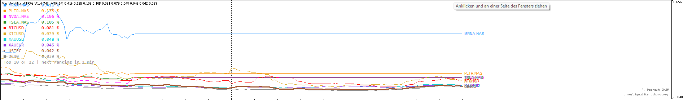
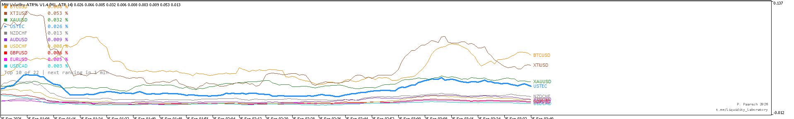

# MW Volatility

MQL5 indicators that rank the volatility of every symbol in your Market Watch, drawn as one line per symbol in a separate sub-window — so you can spot the most active markets at a glance instead of clicking through the Market Watch one symbol at a time.

Two builds from a single source file:

| Indicator | What it shows |
|---|---|
| **MW Volatility ATR%** | ATR as a percentage of the close price — directly comparable across symbols regardless of price scale (a stock at $400 vs. a pair at 1.10). |
| **MW Volatility Percentile** | Percentile rank (0–100) of the current ATR against the symbol's own recent history, with 20/80 levels. |

## Screenshots

M2 chart, ranking the whole Market Watch:



M1 chart:



## Key features (ATR% build, current: V1.4)

- Ranks the **entire Market Watch**, not just the first symbols in the list — shows the actual Top 10 by ATR%.
- Re-ranks on a configurable interval (default every 5 minutes); symbols that stay in the Top 10 keep their slot and color, only risers/fallers swap.
- Reads *only* the symbols you selected in the Market Watch (`SymbolsTotal(true)` / `SymbolName(i, true)`) — never calls `SymbolSelect()`, never touches your Market Watch selection.
- Calculation timeframe is selectable per instance (any timeframe, including M2/M10), independent of the chart timeframe.
- Up to 10 lines at once, overflow shown as "+N not shown" in the legend.
- Chart symbol is highlighted with a thicker line.
- Optional end-of-line symbol labels (Tiny/Small/Medium/Normal).
- Per-call compute time is capped and spread across ticks so it never blocks the chart thread; a shared load report is written to the Experts log every 5 minutes.
- `Max bars to calculate` input keeps history load bounded.

See [CHANGELOG.md](CHANGELOG.md) for the full version history.

## Installation

1. Copy the `.mq5` file(s) into `MQL5/Indicators/` of your MetaTrader 5 data folder.
2. Compile in MetaEditor (or drop the matching `.ex5` directly into the same folder).
3. Attach to any chart — the indicator opens its own sub-window.

## Repository layout

```
MW_Volatility_ATRPct_V1.x.mq5/.ex5      current + prior ATR% versions
MW_Volatility_Percentile_V1.0.mq5/.ex5  percentile-rank version
CHANGELOG.md                             version history
docs/                                    screenshots
```

## License

Copyright 2026 P. Paarsch. All rights reserved — see [LICENSE](LICENSE).

## Contact

[t.me/Liquidity_Laboratory](https://t.me/Liquidity_Laboratory)
